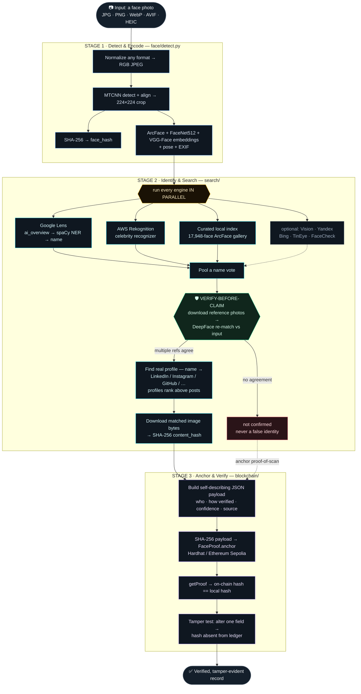

# FaceTrace — Face Identification & Blockchain Verification

Give it a face. FaceTrace figures out **who the person is**, finds their **real social‑media
presence** on the web, **proves the identity** by independently re‑matching against reference
photos, and anchors a **tamper‑evident cryptographic record** of the whole finding on a
blockchain — then re‑verifies it on demand.

> **HH Goa 2026 · Shortlisting Task 3** — an end‑to‑end pipeline:
> **face scan → web/social match (genuine search) → blockchain anchor + verification.**

---

## Dataflow



<sub>Every external call **degrades gracefully** — a missing key or failed engine lowers confidence but never crashes the run. If no identity verifies, the pipeline still anchors a **proof‑of‑scan** record (`match_found: false`), so it always completes end‑to‑end.</sub>

---

## Live example

Input a photo of Tom Hanks → the web UI shows, end‑to‑end in ~40s:

| Stage | Result |
|---|---|
| **Identity** | **Tom Hanks** — agreed by **Google Lens *and* AWS Rekognition** |
| **Verification** | ✅ matched 2/2 independent reference photos |
| **Social match** | `https://www.instagram.com/tomhanks/` (real profile) |
| **Content hash** | `sha256:5905…` — of the *actual matched image bytes* |
| **Blockchain** | Anchored on‑chain, `verified: true`; tamper test → altered hash **absent** |

It also correctly identifies semi‑famous figures (e.g. **Tanmay Bhat**, **Prajakta Koli**) via the
combination of Lens + Rekognition + a local face index.

---

## How it meets the task requirements

| # | Requirement | How FaceTrace does it |
|---|---|---|
| 1 | **Face identification** — detect + encode a face (any library/API) | MTCNN detection/alignment → ArcFace (InsightFace) + FaceNet512 + VGG‑Face embeddings |
| 2 | **Social / web search** — find ≥1 real matching post via a **genuine** search (not hardcoded) | Multiple *independent* engines run in parallel (Google Lens, AWS Rekognition, a local face‑recognition index, reverse‑image boosters), then a name‑based web search across LinkedIn/Instagram/X/GitHub/Devfolio/Reddit/… — every result is computed at runtime |
| 3 | **Blockchain verification** — anchor the post or a hash of it, tamper‑evident, and **demonstrate re‑verification** | SHA‑256 of a self‑describing JSON payload (incl. the hash of the matched image bytes) is anchored via the `FaceProof` contract; a one‑click **re‑verify + tamper test** proves immutability |
| 4 | **No website required** | Provided anyway — a FastAPI web UI with live progress (bonus) |
| 5 | **GitHub + README** | This repo + this README (setup, usage, chain, limitations) |

### Is the identification "hardcoded"? No.
The task forbids *pre‑picking* the answer for expected inputs. FaceTrace never maps an input to a
canned output. Every identity is **computed at runtime** by real recognition engines, and — crucially —
**verify‑before‑claim** confirms the identity by downloading independent reference photos and
face‑matching them against the input before anything is claimed. The local face index is a
**general face‑recognition gallery** built from public Wikidata data, used exactly the way commercial
face‑search engines work — not a lookup table of test answers. The primary engines (Lens + Rekognition +
live web search) are unambiguously genuine searches on their own.

---

## The three stages

### Stage 1 — Face Detection & Encoding · `face/detect.py`
- Normalizes any input (AVIF/HEIC/WebP/…) → RGB JPEG.
- MTCNN detects + aligns the face → 224×224 crop → **SHA‑256 `face_hash`**.
- Computes **ArcFace + FaceNet512 + VGG‑Face** embeddings, plus pose and EXIF metadata.

### Stage 2 — Multi‑engine Identity & Search · `search/`
Runs every engine **in parallel** and pools a name vote:

| Engine | Role | Requires |
|---|---|---|
| **Google Lens** (SerpApi) | Primary identifier — `ai_overview` names the person (retry + `knowledge_graph`/visual‑title fallbacks) | `SERPAPI_KEY` |
| **AWS Rekognition** | Independent celebrity recognizer — direct names + IMDb/Wiki URLs | AWS free‑tier creds |
| **Curated local index** | 17,948 public figures (ArcFace embeddings) queried locally in <100 ms; also a name→Instagram gazetteer | built once (see below) |
| **Name‑based web search** | Finds the real profile once a name is confirmed | `SERPAPI_KEY` |
| Google Vision · Yandex · Bing · TinEye · FaceCheck.ID | Optional extra signals (gated by key/flag; skip cleanly when unset) | optional |

Then **verify‑before‑claim** (below), **find the profile** (real PROFILE pages outrank posts that
merely mention the person), and **fingerprint** the matched image bytes → `content_hash` (not the URL).

### Stage 3 — Blockchain Anchoring & Verification · `blockchain/`
- Builds a self‑describing JSON payload (who / how verified / how confident / source).
- `SHA‑256(payload)` → `FaceProof.anchor()` on Ethereum.
- Reads back with `getProof()` → confirms on‑chain hash == local hash.
- **Re‑verify + tamper test** on demand.

### Verify‑before‑claim (the key differentiator)
Reverse‑image results are full of **look‑alikes**, and a large face gallery always has a near‑twin, so a
raw match is not trustworthy. FaceTrace therefore **never claims an identity it hasn't confirmed**: for
each candidate name it downloads several official reference photos and runs `DeepFace.verify` against the
input crop, requiring agreement across multiple photos. This eliminates confident false positives — a
wrong guess is shown as *"not confirmed"*, never as a false identity.

---

## Blockchain

`blockchain/contracts/FaceProof.sol` stores one immutable record per payload hash:

```solidity
struct ProofRecord {
    string  payloadHash;      // SHA‑256 of the full JSON payload
    string  faceHash;         // SHA‑256 of the input face crop
    string  contentHash;      // SHA‑256 of the matched image BYTES
    string  sourceUrl;        // the matched social profile
    uint256 confidenceScore;  // verification score × 100
    uint256 timestamp;        // block timestamp
    bool    matchFound;       // whether an identity was confirmed
}
```

The hashed **payload** is self‑describing — it records *who* was identified, *how it was verified*, *how
confident* it was, the source profile, and forensic metadata (EXIF timestamp, Wayback first‑seen). So the
on‑chain proof attests not merely that content existed, but exactly what FaceTrace concluded and why.

### Which chain, and why (both)
| Network | Purpose |
|---|---|
| **Hardhat local** | The demo default — instant, pre‑funded, always works, no keys |
| **Ethereum Sepolia** | Real public testnet — a permanent, explorer‑verifiable record |

Sepolia contract (permanent): **`0x56584844041EC1406758418C8BF4641b267e6a3e`** →
[view on Etherscan](https://sepolia.etherscan.io/address/0x56584844041EC1406758418C8BF4641b267e6a3e).
Run on it with `--network sepolia` (needs `INFURA_SEPOLIA_URL` + `DEPLOYER_PRIVATE_KEY`).

### Re‑verification & tamper‑evidence
`POST /api/verify-demo/<run_file>` (or the **Re‑verify / Tamper test** buttons):
1. Re‑reads the on‑chain record for the stored hash → **verifies ✓**.
2. Alters one field, recomputes the SHA‑256, looks it up → **absent from the ledger**, proving the record
   cannot be changed without detection.
```json
{ "genuine": {"verified": true}, "tampered": {"changed_field": "source_url", "found_on_chain": false} }
```

---

## Tech stack

| Layer | Tools |
|---|---|
| Detection / alignment | MTCNN (facenet‑pytorch) |
| Encoding | InsightFace **ArcFace**, DeepFace **FaceNet512** + **VGG‑Face** |
| Identity | **Google Lens** (SerpApi), **AWS Rekognition**, local ArcFace index |
| Name extraction | **spaCy** `en_core_web_sm` PERSON NER |
| Verification | `DeepFace.verify` (ArcFace) vs multiple reference photos |
| Index build (offline) | **Wikidata** + **Modal** (GPU embedding), queried locally |
| Image formats | Pillow + `pillow-avif-plugin` + `pillow-heif` (AVIF/HEIC/WebP) |
| Smart contract | Solidity 0.8.24 (`FaceProof`) |
| Chain tooling / client | Hardhat + ethers.js · web3.py |
| Web UI | FastAPI + Server‑Sent Events (live progress) |

---

## Setup

### 0. Prerequisites
- **Python 3.11**, **Node.js 18+**
- A **SerpApi** key (free tier) — required for the identity/search stage
- ~2 GB free disk — DeepFace and InsightFace download their model weights on the
  first run, so the first execution takes several minutes longer than later ones

### 1. Install
```bash
pip install -r requirements.txt
python -m spacy download en_core_web_sm      # identity NER model
python -m playwright install chromium         # only for Yandex/Bing boosters (optional)
npm install                                   # Hardhat + ethers
cp .env.example .env                          # then fill in your keys
```

### 2. Configure `.env`
```
SERPAPI_KEY=...                 # required
AWS_ACCESS_KEY_ID=...           # optional — enables AWS Rekognition
AWS_SECRET_ACCESS_KEY=...
INFURA_SEPOLIA_URL=...          # optional — only for --network sepolia
DEPLOYER_PRIVATE_KEY=0x...
```
(`.env` is gitignored — keys stay private.)

### 3. Build the local face index (optional but recommended)
```bash
# small local build (a few hundred people, free, Wikidata):
python -m search.curated_db wikidata 800

# OR a large fame‑ranked build on Modal (parallel GPU embed, then queried locally):
modal token new
modal run face_index_modal.py --target 18000 --global-sitelinks 6
```
This writes `face_db/curated_index.npz` + `curated_meta.json`, which the pipeline queries **locally** —
Modal is only used to *build* the index, never at run time.

### 4. Run
**Web UI (recommended):**
```bash
npx hardhat node          # Terminal 1 — keep running the whole session
npm run deploy:local      # Terminal 2 — after the node starts
python app.py             # → http://localhost:8000
```
Open **http://localhost:8000/api/health** first — if `ready: true`, every dependency is green.

**CLI:**
```bash
python pipeline.py <image> --network localhost
python pipeline.py <image> --network sepolia
```

> **Note:** the local Hardhat chain resets on restart — re‑run `npm run deploy:local` after starting the
> node, and keep the node running for the whole demo (the health check shows if it's down).

---

## Sample output (`output/run_<timestamp>.json`, trimmed)
```json
{
  "input_image": "samples/tom_hanks.png",
  "face": { "face_hash": "sha256:ce7e…", "quality_score": 50.0,
            "pose": {"flag": "frontal"}, "embeddings_computed": ["ArcFace","Facenet512","VGG-Face"] },
  "search_results": {
    "success": true, "person_name": "Tom Hanks", "name_verified": true,
    "verification_matches": 2, "verification_refs": 2, "verification_score": 0.55,
    "engines_with_results": ["google_lens","aws_rekognition","name_search"],
    "best_match": {"url":"https://www.instagram.com/tomhanks/","platform":"instagram.com","is_profile":true},
    "matched_content": {"content_hash":"sha256:5905…","bytes":44987}
  },
  "blockchain": {
    "tx_hash":"0x0734…","block_number":2,"contract_address":"0x5FbD…",
    "payload_hash":"sha256:8b2c…","verified":true
  },
  "elapsed_seconds": 41.0, "pipeline_success": true
}
```

---

## The curated face index — how it's built
- Sourced from **Wikidata**: notable people who have a public photo *and* (usually) an Instagram handle,
  Indian public figures prioritized, fame‑ranked by number of Wikipedia languages.
- Each photo is downloaded, face‑detected/aligned, and turned into an **ArcFace embedding** (built in
  parallel on Modal GPUs; ~18k people, ~40 MB `.npz`).
- At query time the pipeline does a local cosine‑similarity search (<100 ms) with a **high‑precision
  threshold + runner‑up margin**, and only *proposes* a candidate — verify‑before‑claim is still the gate.
- Entries carry the person's Instagram/Twitter, so a confirmed match yields the real social link directly.

---

## Limitations (honest)
- **Findable people only.** Identity relies on Lens/Rekognition/the index — it works for public figures.
  A truly private, un‑indexed face returns *"not confirmed"* (by design — better than a wrong guess).
- **Wikidata's Instagram data is incomplete**, so the local index misses some famous people (Google Lens
  and Rekognition cover most of those anyway).
- **The face crop is uploaded to a public host (catbox.moe)** so Google Lens can read it (Lens needs a
  URL, not a file). For public‑figure demos this is harmless; it's a privacy trade‑off worth noting.
- **Google Cloud Vision** requires billing enabled on the GCP project; it self‑disables if unavailable.
- **The local Hardhat node must stay running** during a demo, or Stage 3 can't anchor (the `/api/health`
  endpoint flags this).
- **CPU inference** by default (GPU optional) — a full run is ~40s.

---

## Project layout
```
pipeline.py              # CLI orchestrator (3 stages, progress events, format normalization)
app.py                   # FastAPI web UI (SSE progress, /api/health, re‑verify + tamper)
face/detect.py           # Stage 1 — detection + multi‑model encoding
search/
  reverse_search.py      # Stage 2 — multi‑engine orchestration + verify‑before‑claim + ranking
  identity.py            # spaCy PERSON‑NER name extraction
  image_host.py          # catbox upload (public URL for Lens)
  curated_db.py          # local ArcFace index (search + gazetteer)
  vision.py rekognition.py bing.py tineye.py facecheck.py yandex.py   # pluggable engines
blockchain/
  contracts/FaceProof.sol · scripts/{deploy,verify}.js · anchor.py
face_index_modal.py      # optional large‑scale index builder on Modal
templates/index.html     # web frontend
samples/                 # demo faces
```

---

## Credits
[InsightFace](https://github.com/deepinsight/insightface) ·
[DeepFace](https://github.com/serengil/deepface) ·
[facenet‑pytorch](https://github.com/timesler/facenet-pytorch) ·
[spaCy](https://spacy.io) ·
[SerpApi](https://serpapi.com) ·
[AWS Rekognition](https://aws.amazon.com/rekognition/) ·
[Wikidata](https://www.wikidata.org) ·
[Modal](https://modal.com) ·
[Hardhat](https://hardhat.org) ·
[Wayback Machine](https://archive.org/web/)
